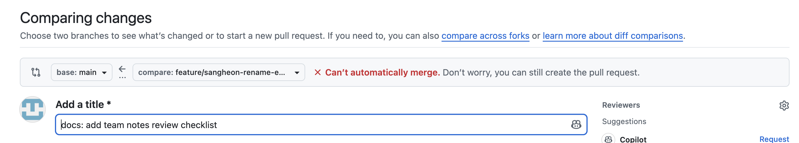
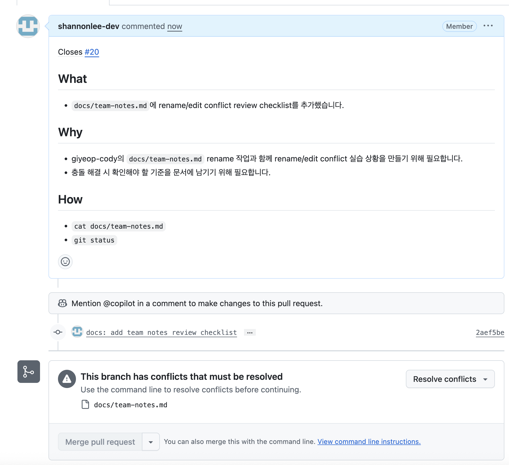
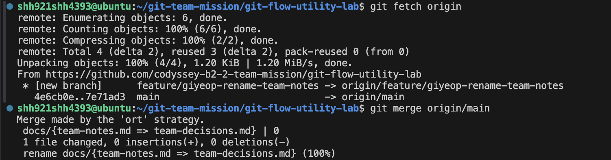

# Conflict Resolution Log

## 충돌 기록 #1
### 참여자
- 작성자: KANGSIK-SEO
- 상대: giyeop-cody

### 상황(What happened)
- `feature/giyeop-even-check-fix` 브랜치에서 `README.md`의 `Current status` 섹션을 수정하던 중 충돌이 발생했습니다.
- 해당 브랜치에서는 `normalize_member_name`, `count_words`, `is_even` 수정 내용을 한 번에 완료된 항목으로 정리했습니다.
- 반면 `main` 브랜치에는 `normalize_member_name`과 `count_words` 수정만 반영되어 있고, `is_even`은 아직 남은 starter gap으로 기록되어 있었습니다.
- 앞선 PR의 merge가 끝나기 전에 저장소를 clone한 뒤 그 기준으로 commit과 push를 진행했기 때문에, 브랜치가 최신 `main`과 다른 상태에서 작업하게 되었습니다.
- 그 결과 두 브랜치가 README의 같은 위치를 서로 다른 기준으로 수정했고, GitHub에서 PR #9를 merge하려는 과정에서 같은 hunk에 충돌이 발생했습니다.

### 충돌 내용(Conflict markers)
```txt
<<<<<<< feature/giyeop-even-check-fix
- Sangheon Lee PR 2: `normalize_member_name`이 내부 여러 공백을 하나로 정리하도록 수정했습니다.
- KANGSIK-SEO PR 1: `count_words`가 연속 공백과 공백 문자열을 자연스럽게 처리하도록 수정했습니다.
- giyeop-cody PR 1: `is_even`이 짝수일 때 `True`, 홀수일 때 `False`를 반환하도록 수정했습니다.
=======
Sangheon Lee PR에서 이름 정규화 문제를 수정했습니다.
KANGSIK-SEO PR에서 `count_words`가 연속 공백과 공백만 있는 문자열을 실제 단어 수 기준으로 처리하도록 수정했습니다.

남은 starter gap:

- `is_even`은 아직 함수 이름과 다르게 동작합니다.
>>>>>>> main
```

````txt
<<<<<<< feature/giyeop-even-check-fix
is_even: True
```

## 추가 확인 예시

```text
normalize_member_name("  sangheon   lee ") == "Sangheon Lee"
member_name_slug("  sangheon   lee ") == "sangheon-lee"
count_words("Git  flow utility") == 3
count_words("   ") == 0
is_even(4) == True
is_even(5) == False
```
=======
is_even: False
```

추가 확인 예시:

- `count_words("Git  flow utility") == 3`
- `count_words("   ") == 0`
>>>>>>> main
````

### 해결 과정(How)
- 선택한 해결 전략은 `choose one`입니다.
- 이번 PR의 목적이 `is_even`을 함수 이름에 맞게 수정하고, README에도 완료 상태와 추가 확인 예시를 반영하는 것이었기 때문에 `feature/giyeop-even-check-fix` 쪽 변경을 살렸습니다.
- 첫 번째 충돌에서는 다음 내용을 유지했습니다.

```txt
- Sangheon Lee PR 2: `normalize_member_name`이 내부 여러 공백을 하나로 정리하도록 수정했습니다.
- KANGSIK-SEO PR 1: `count_words`가 연속 공백과 공백 문자열을 자연스럽게 처리하도록 수정했습니다.
- giyeop-cody PR 1: `is_even`이 짝수일 때 `True`, 홀수일 때 `False`를 반환하도록 수정했습니다.
```

- 두 번째 충돌에서도 `is_even: True`와 `is_even(4) == True`, `is_even(5) == False`가 포함된 추가 확인 예시를 유지했습니다.
- 로컬에서 commit과 push는 정상적으로 완료했고, GitHub에서 PR 본문을 작성한 뒤 merge하려는 시점에 conflict 해결이 필요하다는 안내를 확인했습니다.
- GitHub의 PR #9 conflict 화면으로 이동해 `Accept Current Change`를 선택하여 feature 브랜치의 내용을 유지하고, conflict marker를 제거한 뒤 해결을 완료했습니다.

### 결과(Outcome)
- README에는 `normalize_member_name`, `count_words`, `is_even` 수정이 모두 완료된 항목으로 정리되었습니다.
- 실행 예시도 `is_even` 수정 결과에 맞게 `is_even: True`와 짝수/홀수 추가 확인 예시를 포함하도록 정리되었습니다.
- 관련 PR: [#9](https://github.com/codyssey-b2-2-team-mission/git-flow-utility-lab/pull/9/conflicts)

### 배운 점(Learnings)
- 다른 PR이 merge되기 전 기준으로 clone하거나 branch를 만들면, 이후 `main`이 바뀌었을 때 README처럼 같은 섹션을 수정하는 파일에서 충돌이 쉽게 발생할 수 있습니다.
- 작업을 시작하기 전과 push 전에는 `main`의 최신 변경을 먼저 반영하고, PR 본문에도 어떤 기준의 변경을 유지했는지 명확히 기록해야 합니다.
- GitHub UI에서 conflict를 해결할 때는 `Accept Current Change`가 어떤 브랜치의 내용을 의미하는지 확인하고, 특히 실행 예시처럼 결과 값이 바뀌는 부분은 코드 변경 목적과 일치하는지 다시 검토해야 합니다.

## 충돌 기록 #2
### 참여자
- 작성자: Sangheon Lee
- 상대: giyeop-cody

### 상황(What happened)
- giyeop-cody는 `feature/giyeop-rename-team-notes` 브랜치에서 `docs/team-notes.md`를 `docs/team-decisions.md`로 rename했습니다.
- Sangheon Lee는 giyeop-cody의 rename PR이 `main`에 merge되기 전 기준에서 `feature/sangheon-rename-edit-conflict-resolution` 브랜치를 만들고, 원본 `docs/team-notes.md`에 rename/edit conflict review checklist를 추가했습니다.
- 이후 giyeop-cody의 rename PR #19가 `main`에 먼저 merge되면서, Sangheon Lee 브랜치는 `docs/team-notes.md`를 수정한 상태이고 `main`은 같은 파일을 `docs/team-decisions.md`로 rename한 상태가 되었습니다.
- GitHub PR 화면에서는 두 브랜치를 자동으로 merge할 수 없다는 안내와 함께 `docs/team-notes.md` conflict가 표시되었습니다.

### 증빙 화면(Screenshots)






### 충돌 내용(Conflict markers)
```txt
GitHub PR UI:
This branch has conflicts that must be resolved.
docs/team-notes.md

Command line merge:
git fetch origin
git merge origin/main
Merge made by the 'ort' strategy.
docs/{team-notes.md => team-decisions.md} | 0
rename docs/{team-notes.md => team-decisions.md} (100%)
```

### 해결 과정(How)
- 선택한 해결 전략은 `keep both`입니다.
- 파일명은 giyeop-cody의 rename 목적에 맞게 최종 파일을 `docs/team-decisions.md`로 유지했습니다.
- Sangheon Lee가 `docs/team-notes.md`에 추가한 rename/edit conflict review checklist 내용도 `docs/team-decisions.md`에 보존했습니다.
- 로컬에서 `git fetch origin`으로 최신 `main`을 가져온 뒤 `git merge origin/main`을 실행했습니다.
- Git은 `ort` 전략으로 rename을 감지했고, `docs/team-notes.md`에서 `docs/team-decisions.md`로의 rename을 merge commit에 반영했습니다.
- 최종 파일에서 `docs/team-notes.md`는 제거되고 `docs/team-decisions.md`만 남아 있는지 확인했습니다.

### 결과(Outcome)
- 최종 파일은 `docs/team-decisions.md`로 정리되었습니다.
- 기존 팀 결정 내용과 Sangheon Lee의 rename/edit conflict review checklist가 함께 유지되었습니다.
- `docs/team-notes.md`는 최종 브랜치에 남아 있지 않습니다.
- 선행 rename PR: [#19](https://github.com/codyssey-b2-2-team-mission/git-flow-utility-lab/pull/19)
- 해결 커밋: [`34d7511`](https://github.com/codyssey-b2-2-team-mission/git-flow-utility-lab/commit/34d751173df2d3355f1814c6ccd57c1e8c329947)
- merge 커밋: [`97d8e1b`](https://github.com/codyssey-b2-2-team-mission/git-flow-utility-lab/commit/97d8e1b0ef5c1158daba1f432f4928a5531540cc)

### 배운 점(Learnings)
- rename 작업과 edit 작업이 같은 파일을 대상으로 진행될 때는 PR 순서와 기준 브랜치를 먼저 공유해야 합니다.
- rename PR이 먼저 merge될 예정이라면 edit 담당자는 최신 `main`을 반영한 뒤 새 파일명에 수정하는 편이 안전합니다.
- GitHub UI에서 conflict가 보이면 로컬에서 `git fetch origin`과 `git merge origin/main`으로 실제 파일 상태를 확인하고, rename된 최종 파일에 edit 내용이 보존되었는지 검토해야 합니다.
